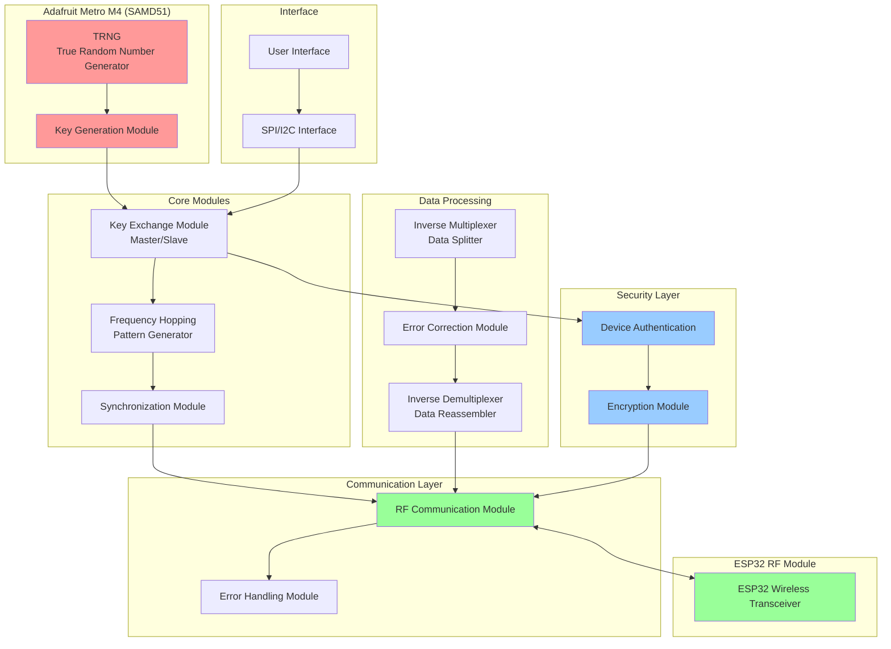
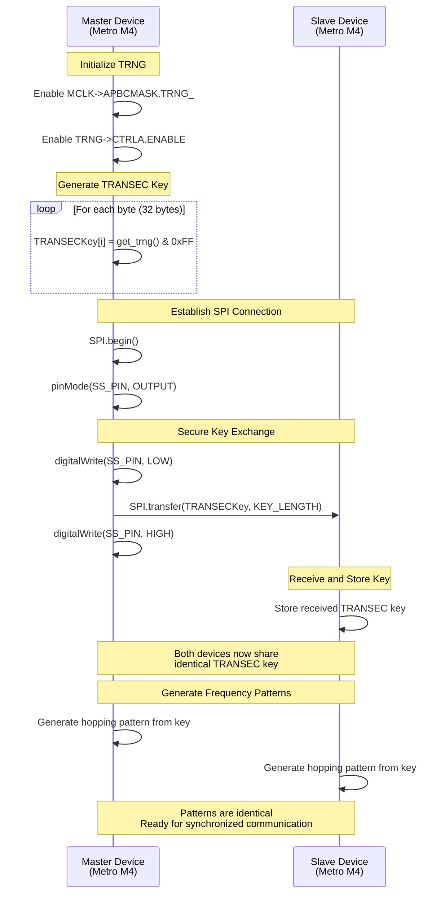
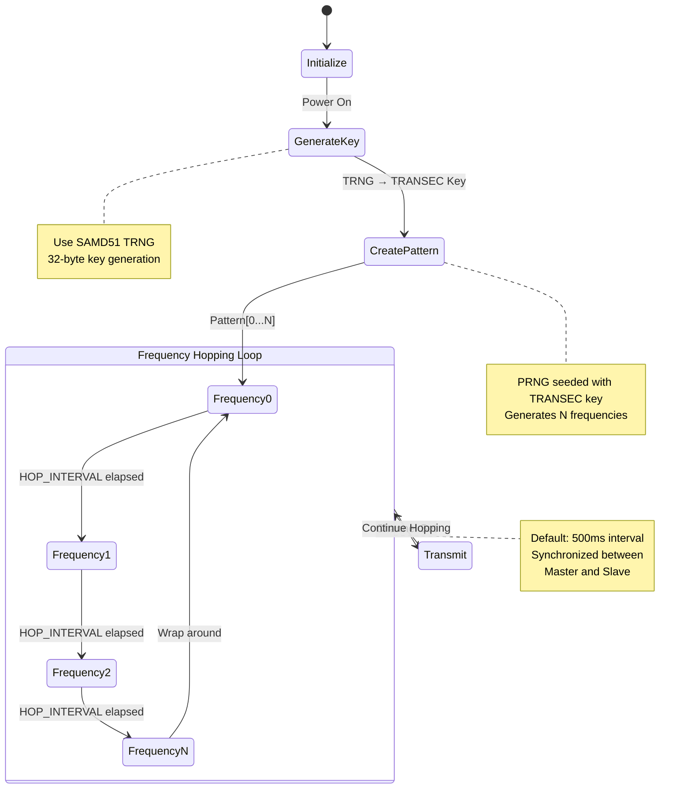
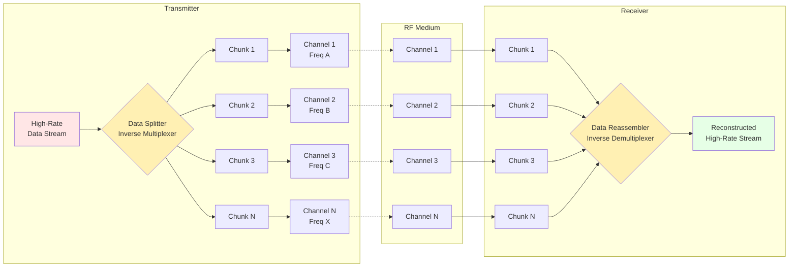
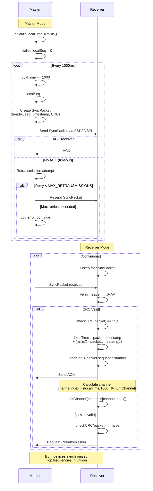
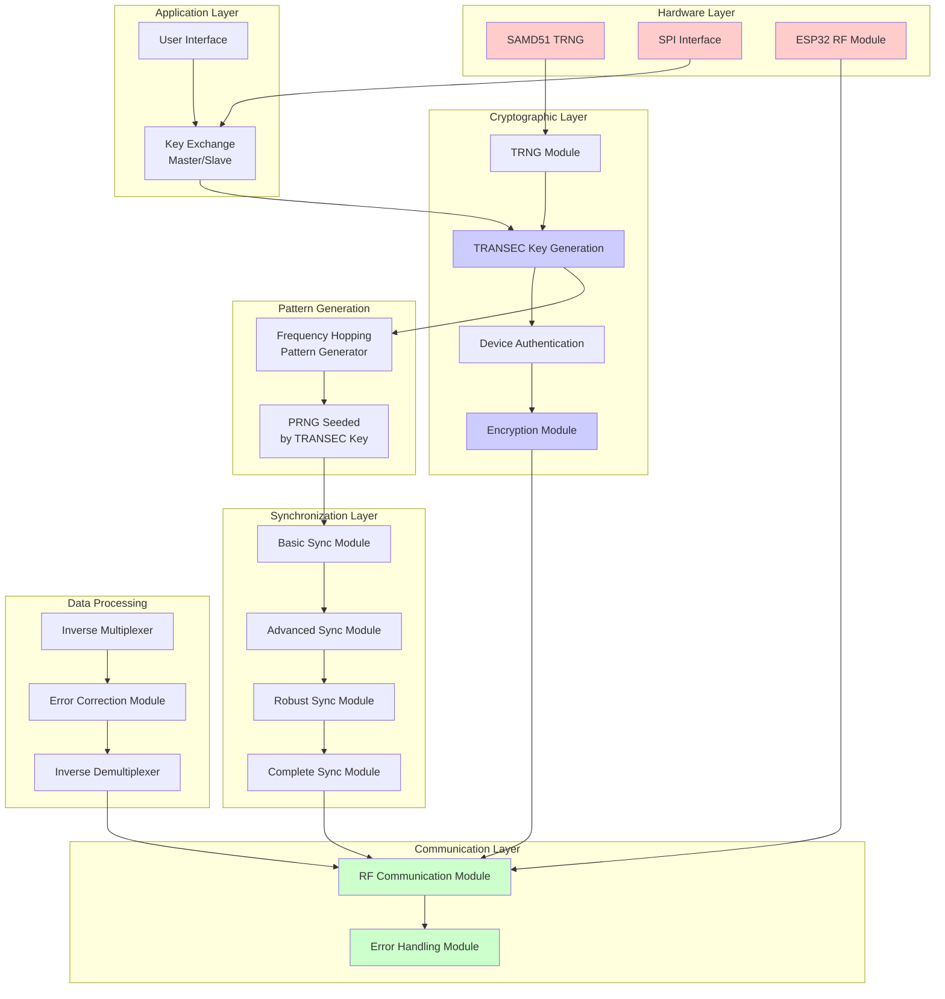
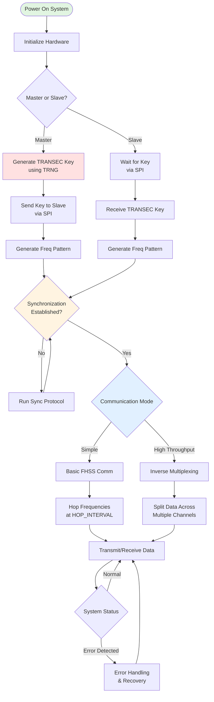

# Adafruit Metro FHSS TRANSEC System

A Frequency-Hopping Spread Spectrum (FHSS) TRANSEC key system for Adafruit Metro M4 boards using the SAMD51's True Random Number Generator (TRNG).

## Table of Contents

- [Overview](#overview)
- [System Architecture](#system-architecture)
- [Key Features](#key-features)
- [Module Descriptions](#module-descriptions)
- [System Diagrams](#system-diagrams)
  - [System Architecture Diagram](#system-architecture-diagram)
  - [Key Exchange Flow](#key-exchange-flow)
  - [Frequency Hopping Sequence](#frequency-hopping-sequence)
  - [Inverse Multiplexing Process](#inverse-multiplexing-process)
  - [Synchronization Flow](#synchronization-flow)
  - [Module Dependencies](#module-dependencies)
- [Getting Started](#getting-started)
- [Hardware Requirements](#hardware-requirements)
- [Security Considerations](#security-considerations)

## Overview

Military radios generate a frequency-hopping pattern under the control of a secret Transmission Security Key (TRANSEC) that the sender and receiver share in advance. This project implements a similar system using Adafruit Metro M4 boards with the SAMD51's TRNG to generate and share TRANSEC keys over SPI, I2C, and other interfaces.

### Key Concepts

1. **Key Generation**: Each board uses the SAMD51's TRNG to generate cryptographically secure random TRANSEC keys
2. **Key Exchange**: Secure exchange protocol between Master and Slave devices
3. **Frequency Hopping**: Pseudorandom frequency pattern generation seeded by the TRANSEC key
4. **Inverse Multiplexing**: High-rate data streams split across multiple frequency channels for improved throughput and reliability
5. **Synchronization**: Precise timing coordination between transmitter and receiver

## System Architecture

The system consists of multiple modular components working together to provide secure, reliable RF communication:

## Key Features

- **True Random Key Generation**: Utilizes SAMD51's hardware TRNG for cryptographically secure keys
- **Secure Key Exchange**: Master-Slave architecture for TRANSEC key distribution
- **Frequency Hopping**: Dynamic frequency switching based on shared TRANSEC keys
- **Inverse Multiplexing**: Data distribution across multiple channels for:
  - Increased throughput
  - Improved reliability and redundancy
  - Enhanced security through channel diversity
  - Better load balancing
- **Robust Synchronization**: Multiple synchronization strategies with error recovery
- **Error Handling**: ARQ (Automatic Repeat Request) and forward error correction
- **Device Authentication**: Secure authentication before communication
- **Encryption**: Additional data payload encryption for enhanced security

## Module Descriptions

### Core Modules

| Module | File | Description |
|--------|------|-------------|
| **Main System** | `FHSS_TRANSEC_SAMD51_SPI.ino` | Primary implementation with TRNG, key generation, and frequency hopping |
| **Frequency Hopping** | `FrequencyHoppingPatternGenerator.ino` | Generates pseudorandom frequency patterns from TRANSEC keys |
| **Master Key Exchange** | `Master_TRANSEC_Key_Exchange.ino` | Master device for secure key distribution via SPI |
| **Slave Key Exchange** | `Slave_TRANSEC_Key_Exchange.ino` | Slave device for receiving TRANSEC keys |

### Communication Modules

| Module | File | Description |
|--------|------|-------------|
| **RF Communication** | `RFCommunicationModule.ino` | Handles packet transmission/reception and frequency changes |
| **Error Handling** | `ErrorHandlingModule.ino` | ARQ implementation for lost packets and interference |

### Synchronization Modules

| Module | File | Description |
|--------|------|-------------|
| **Basic Sync** | `SynchronizationModule.ino` | Fundamental synchronization for frequency hopping |
| **Advanced Sync** | `AdvancedSynchronizationModule.ino` | Enhanced timing with packet timestamping |
| **Robust Sync** | `RobustSynchronizationModule.ino` | Delay compensation and advanced error handling |
| **Complete Sync** | `CompleteSynchronizationModule.ino` | Full-featured synchronization with ESP32 integration |

### Inverse Multiplexing Modules

| Module | File | Description |
|--------|------|-------------|
| **Dynamic InvMux** | `DynamicInverseMultiplexerModule.ino` | Splits high-rate data across multiple channels |
| **Dynamic InvDemux** | `DynamicInverseDemultiplexerModule.ino` | Reassembles data from multiple channels |
| **Synchronized InvDemux** | `SynchronizedInverseDemultiplexerModule.ino` | Time-synchronized data reassembly |
| **Error Correction InvDemux** | `ErrorCorrectionInverseDemultiplexerModule.ino` | Demultiplexing with forward error correction |
| **Basic InvMux** | `InverseMultiplexerModule.ino` | Simple inverse multiplexing implementation |

### Security Modules

| Module | File | Description |
|--------|------|-------------|
| **Encryption** | `EncryptionModule.ino` | Data payload encryption for secure transmission |
| **Device Authentication** | `DeviceAuthenticationModule.ino` | Authenticates devices before allowing communication |

### Interface Modules

| Module | File | Description |
|--------|------|-------------|
| **User Interface** | `UserInterface.ino` | Serial/physical interface for system control and monitoring |

## System Diagrams

### Key Exchange Flow

### Frequency Hopping Sequence

### Inverse Multiplexing Process

**Benefits of Inverse Multiplexing:**
1. **Increased Throughput**: Aggregate bandwidth across multiple channels
2. **Improved Reliability**: Redundancy across channels mitigates interference
3. **Enhanced Security**: Eavesdropper must intercept all channels
4. **Load Balancing**: Distributes traffic across available spectrum
5. **Adaptive Performance**: Adjust channel count based on conditions

### Synchronization Flow

### Module Dependencies

## Getting Started

### Basic Setup

1. **Hardware Setup**
   - Connect two Adafruit Metro M4 boards via SPI
   - Ensure one board is designated as Master, the other as Slave
   - Connect ESP32 RF module to each board (if using wireless communication)

2. **Upload Firmware**
   - Upload `Master_TRANSEC_Key_Exchange.ino` to the master board
   - Upload `Slave_TRANSEC_Key_Exchange.ino` to the slave board

3. **Key Exchange**
   - Power on the master board first
   - Power on the slave board
   - Verify key exchange success via Serial Monitor

4. **Start Communication**
   - Both boards will automatically generate identical frequency hopping patterns
   - RF communication will begin with synchronized frequency hopping

### Example Usage Flow

## Hardware Requirements

- **Microcontroller**: Adafruit Metro M4 (SAMD51) x2 minimum
- **RF Module**: ESP32 or compatible RF transceiver
- **Communication**: SPI or I2C interface between boards
- **Power**: Stable 5V supply for each board
- **Optional**: LEDs for status indication, buttons for mode selection

## Security Considerations

### Strengths

1. **Cryptographic Key Generation**: Hardware TRNG provides high-quality randomness
2. **Frequency Hopping**: Difficult to intercept without knowing the pattern
3. **Inverse Multiplexing**: Requires intercepting all channels simultaneously
4. **Device Authentication**: Prevents unauthorized devices from joining network
5. **Encryption**: Additional payload encryption layer

### Important Notes

⚠️ **This is an educational/experimental implementation**

- Not certified for military or commercial security applications
- Secure key exchange (`exchangeKeys()`) requires proper cryptographic protocols (e.g., Diffie-Hellman, RSA)
- Radio frequency usage must comply with local regulations (FCC, ETSI, etc.)
- Physical security of devices is critical - compromised hardware = compromised keys

### Recommendations for Production Use

1. Implement proper asymmetric key exchange (e.g., ECDH)
2. Use established cryptographic libraries (e.g., BearSSL, Crypto)
3. Add tamper detection and secure key storage
4. Implement certificate-based authentication
5. Regular security audits and penetration testing
6. Comply with relevant RF regulations and standards

## Additional Resources

- **ESP32 Integration**: See `ESP32_Firmware_Proposal.txt` for detailed ESP32 firmware specifications
- **Original Documentation**: See `README.txt` for the original project proposal and technical discussion

## License

Educational and experimental use. Ensure compliance with local RF regulations before deploying any wireless communication system.

## Contributing

Contributions are welcome! Please ensure any modifications maintain security best practices and include appropriate documentation.

---

**Note**: This system is designed for educational purposes to demonstrate FHSS concepts, TRANSEC key management, and secure communication principles. Always consult with security professionals and ensure regulatory compliance before deploying in any real-world scenario.
